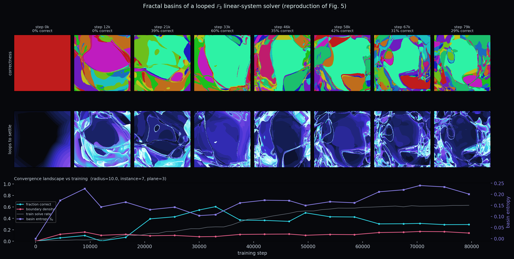
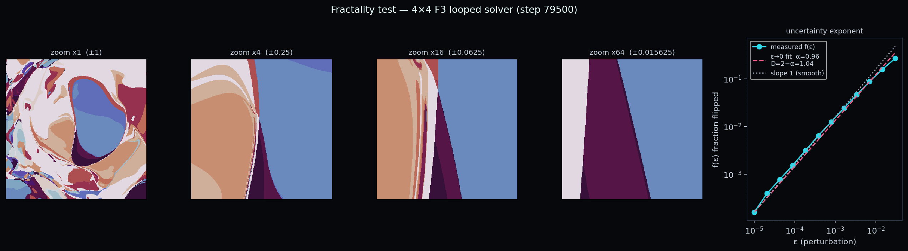

# Fractal basins of a looped transformer solving 𝔽ₚ linear systems

A from-scratch reproduction of the **linear-system experiment (Figure 5)** of
*"Fractal basins trap latent reasoning"* (Lai, Bao, Quinn, Gilpin, 2026,
[arXiv:2609.04963](https://arxiv.org/abs/2609.04963)).

A bidirectional **looped transformer** is trained to solve `A x = b` over the finite
field 𝔽ₚ. We then map its **basins of attraction**: for a fixed problem we perturb the
initial latent state over a random 2-plane, iterate the recurrent map, and colour each
point by whether it converges to the correct solution and by how many loops it takes.
As the model learns to solve, the latent landscape develops intricate, **fractal basin
boundaries** — the "basins trap latent reasoning" phenomenon.



## Task & encoding

Solve `A x = b` with `A ∈ 𝔽ₚ^{M×N}`, `b ∈ 𝔽ₚ^M`, `x ∈ 𝔽ₚ^N` (`A` invertible ⇒ unique `x`).
Each instance is one token sequence (for `p=3, M=N=8` this is **97 tokens**, as in the paper):

```
a_11 … a_18 | b_1 ;   …   a_81 … a_88 | b_8 ;   =   ? ? ? ? ? ? ? ?
└────────── 8 rows (8·11 = 88) ──────────┘       └──── 8 answer slots ────┘
```

Vocabulary is tiny: the field elements `0..p-1` plus `| ; = ?` (tied embeddings).

## Model (per the paper's authors)

Encoder-only (bidirectional) **looped** transformer, iterated for `K` loops:

```
e = Embed(tokens)
x = 0
repeat K times:  x ← LayerNorm( x + Block(x + e) )   # token embeddings re-injected each loop
logits = logit_scale · LayerNorm(x) · Ê^T            # tied (cosine) readout
```

One **shared** block, 8 heads, `d_model = 256`, MLP ratio 1, RoPE, tied embeddings
(~0.4 M params). `model.py`.

Two additions were needed for the optimisation to get off the ground (see Findings):
a **learnable logit scale** (cosine readout) and a **difficulty curriculum**.

## Files

| file | role |
|---|---|
| `data.py` | 𝔽ₚ invertible-system generator + 97-token encoder; `n_direct` curriculum knob (number of directly-substitutable unit rows) |
| `model.py` | looped bidirectional transformer (RoPE, tied embeddings, shared block) |
| `train.py` | training loop: random loop-depth, CE on the answer slots, curriculum, optional deep supervision |
| `basins.py` | basin-of-attraction maps: random orthonormal 2-plane, iterate, settle-time + correctness + Sprott–Daza basin entropy |
| `make_figure5.py` | render the Figure-5-style panel from basin `.npz` + training metrics |
| `submit.sh` | SLURM launcher (1 GPU) — trains then computes basins |

## Reproduce

```bash
# train a 4x4 F_3 solver (the tractable, solving regime) + basin maps
python train.py --p 3 --M 4 --N 4 --out runs/n4 --steps 80000 \
    --curriculum_steps 15000 --deep_sup --compile --max_loops 16
python basins.py --run runs/n4 --res 400 --instance_seed 7 --plane_seed 3 --instance_direct 0
python make_figure5.py --basins runs/n4/basins --metrics runs/n4/metrics.jsonl --out figure5.png
```

Needs only `torch` + `numpy` (+ `matplotlib`/`scipy` for rendering). `submit.sh` wraps
the whole train→basins pipeline for a SLURM cluster.

## Findings

- **4×4 𝔽₃ trains to a real solver** (~63 % exact-solve on fully-dense systems) and its
  basins reproduce the Fig. 5 phenomenon: a correct-solution basin surrounded by competing
  wrong attractors with fractal boundaries; the loops-to-settle field is filamentary along
  those boundaries (slow / "trapped" convergence); **basin entropy S_b rises 0 → ~0.25**
  as training proceeds. See `figures/`.
- **8×8 𝔟₃ (the paper's exact size) did not train to a solver** in a multi-hour budget — nor
  did 8×8 GF(2) or 5×5 𝔽₃. The model learns to *copy* directly-substitutable variables but the
  mod-p Gaussian elimination for entangled "core" variables stays at chance (loss pinned at
  `ln p`). This matches the hardness of learning modular arithmetic (grokking-like) and the
  paper's own "directly-substitutable vs core variables" distinction (Fig. 5D). Reaching the
  full 8×8 result likely needs a much longer run to a grokking transition.

## Notes / caveats

The paper does not publish training hyperparameters or the linear-system code/checkpoints
(the authors are still preparing them), so the data-sampling details, curriculum, logit-scale,
optimiser (AdamW, lr 1e-3), and loop schedule here are reasonable choices, not the originals.
The basin methodology (random orthonormal 2-plane via QR, grid [-1,1]², colour by settling
time/correctness, basin entropy) follows the authors' companion repo `terrafying/fractal-basins-lab`.

## Pretrained checkpoint

`checkpoints/n4_f3_step79500.pt` — the 4×4 𝔽₃ solver (0.4 M params, 80k steps,
~60% exact-solve on fresh fully-dense systems). Load and evaluate:

```bash
python eval_checkpoint.py checkpoints/n4_f3_step79500.pt --loops 24
# -> token_acc≈0.80  exact_solve≈0.60  on fresh dense 4x4 F_3 systems
```

Regenerate its basin maps with `basins.py --run <dir>` (point it at a run dir whose
`ckpt/` holds this file) then `make_figure5.py`.

## Is it actually *fractal*? (quantitative test)

Intricate ≠ fractal. `analyze_fractality.py` measures the **uncertainty exponent**
α (Grebogi–McDonald final-state sensitivity: `f(ε) ∼ ε^α`, boundary box-dimension
`D = 2 − α`) in the ε→0 limit, plus a boundary-centred **zoom sequence**.

For the 4×4 𝔽₃ model (500k-point statistics, ε down to 1e-5):

```
α(ε→0) = 0.96   →   D = 2 − α ≈ 1.04
local slope → ~1 as ε→0 ; boundary zoom ×1→×64 resolves to smooth curves
```

**Conclusion: the 4×4 basins are NOT a genuine fractal** — the boundaries are smooth
(D ≈ 1), just many basins packed tightly together ("fragile", intricate, but not
scale-invariant). The headline α≈0.8 you get from a naive fit is an artifact of the
large-ε saturation regime. This is consistent with the paper's framing that fractality
should *emerge with problem hardness* — the easy 4×4 is on the non-fractal side. The
real test of the paper's central claim is whether a **harder, still-solved** system
shows α staying below 1 as ε→0.



## Full-size 8×8 𝔽₃ attempt (negative result)

A long run was made to chase the paper's exact 8×8 𝔽₃ setup, with the grokking-oriented
recipe: 500k steps, loops sampled 4–28, weight decay 0.1 (matmul weights only), deep
supervision, curriculum to 120k, learnable logit scale. 1× H100, ~16.7h, ~512M instances.

**Result: it never learned** — hard (fully-dense) solve-rate stayed at chance
(`loss ≈ ln 3`) across ~380k dense-phase steps; no grokking transition. The resulting
basins are featureless (`frac_correct = 0`, basin entropy ≈ 0). The model consistently
learns to copy directly-substitutable variables but not the mod-3 elimination for
entangled core variables. Reproducing the paper's 8×8 result (their reported bifurcation
at ~150k steps) therefore requires something not captured here — likely their specific
(undisclosed) instance distribution / training recipe, or substantially more scale. The
4×4 𝔽₃ reproduction above remains the solid, working result.
